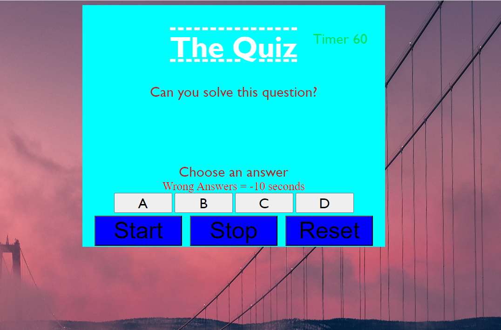

# The Quiz

The Quiz was a unique challenge done for my sibling to help them with math questions.

## How to use

The website is very simple, since it is made for children to learn math. It has an START, STOP. and RESET button, along with a timer.

This is a perfect application for any parent to help their child be better at maths, as the way it is made is simple and easy to use. As well as if the child does not pay attention they will not pass the quiz.

In order to minimize the chances of them cheating, the questions have been randomised.

### Udating the questions

As a devopler I have full access to the question and can add extra questions if needed. 

#### Thank you
